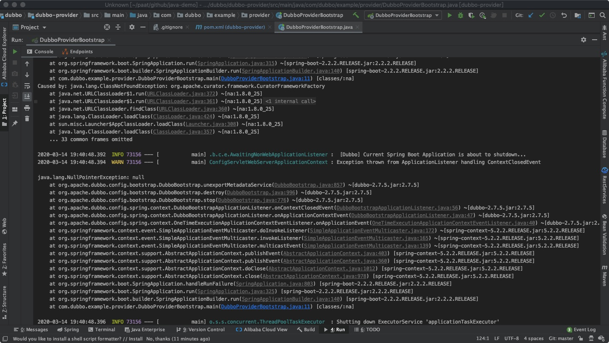
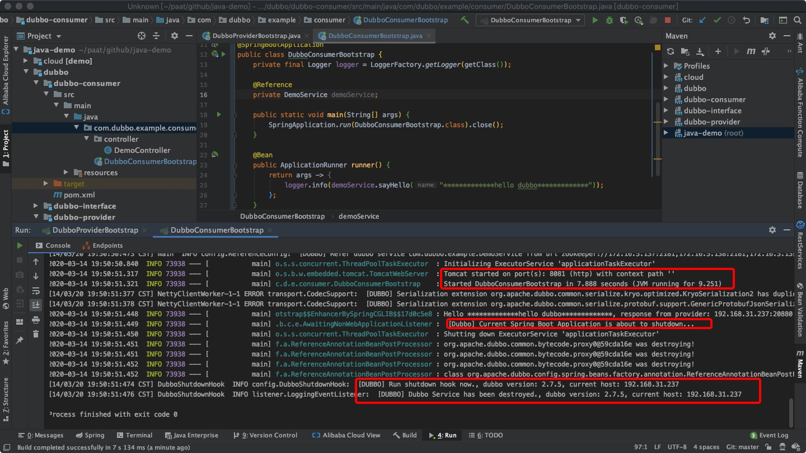

问题1：
Caused by: java.lang.ClassNotFoundException: org.apache.curator.framework.CuratorFrameworkFactory

解决方案：
缺少操作zk api的包
<dependency>
    <groupId>org.apache.dubbo</groupId>
    <artifactId>dubbo-dependencies-zookeeper</artifactId>
    <type>pom</type>
    <exclusions>
        <exclusion>
            <groupId>org.slf4j</groupId>
            <artifactId>slf4j-log4j12</artifactId>
        </exclusion>
    </exclusions>
</dependency>

问题2：项目启动成功远程调用dubbo结果成功，服务立马消亡
 Tomcat started on port(s): 8081 (http) with context path ''
 [Dubbo] Current Spring Boot Application is about to shutdown...
 INFO config.DubboShutdownHook:  [DUBBO] Run shutdown hook now., dubbo version: 2.7.5, current host: 192.168.31.237
 

 解决办法：
 最终经过仔细排查 发现main启动方法，启动成功以后，立马关闭了，删除close()
 SpringApplication.run(DubboConsumerBootstrap.class).close();