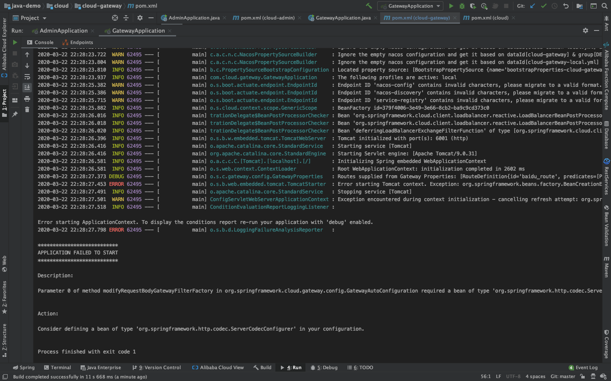

问题1：
Caused by: Consider defining a bean of type 'org.springframework.http.codec.ServerCodecConfigurer' in your configuration.

解决方案：
造成的原因：因为版本jar依赖冲突导致该问题的产生，因为Spring Cloud Gateway 是使用 netty+webflux实现，webflux与web是冲突的。
需要删除该包
<dependency>
    <groupId>org.springframework.boot</groupId>
    <artifactId>spring-boot-starter-web</artifactId>
</dependency>